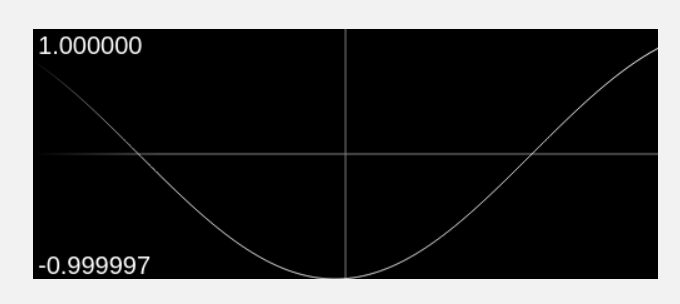

# Gasp Overview

Gasp (Golang active server pages) is a thin wrapper for Go's `http` and `websockets` modules, with the goal being to implement a very simple web framework that's great for small to medium-sized web applications and perfect for when you just need to quickly create a functional UI for testing or trivial apps, etc. 

# Features

With Gasp, you can quickly and easily:
  * Serve dynamic HTML views/pages that are defined in-line or using an editor of your choice
  * Create a form using common controls without writing any HTML/CSS/JavaScript
  * Add your own HTTP request handlers for total control
  * Handle any client-side DOM event in server-side Go code
  * Raise custom client-side events and handle them server-side -- and vice-versa
  * Manage form controls' values/states with fast 2-way data binding
  * Define HTML template variables that you then set server-side when responding to HTTP requests
  * Define "route guards," which intercept HTTP requests for middleware processing and request routing purposes
  * Host static content like CSS, JavaScript, and image resources
  * Ensure all HTTP and WebSockets traffic is encrypted via TLS

<sub>A simple UI and the code used to create it:</sub>  
  
<sub>The UI was created using the **Form API** and would be accessible via `http://localhost:8800`</sub>  

<sub>This UI shows the packet inspector control in action, with its output being sent to a line chart control:</sub>  
  
<sub>The code for this UI can be found in `gasp_test.go`.</sub>


## GoWatch

Another special feature of Gasp is GoWatch, a command-line tool you can use to monitor changes to variables in your project, in realtime (no breakpoints), without having to make any _functional_ changes to your code!  See `Using GoWatch to Monitor Variables` for details.

# Installation

There are no external dependencies to install.  Simply import the module:
```go
import ui "tonysoft.com/gasp"
```

The examples in this README assume the module is imported with the alias `ui`.

# API Overview

Gasp offers two API's, each with a distinct goal:

  * **Server API** If you intend to create multiple views/pages or need full control over their design/functionality, then you must use this API.  Think of this API as the "full-featured" one but the more complex of the two, mainly because it requires you to provide the HTML for the views.


  * **Form API** If you just need a single, simple view/form with a set of common controls, try this API before resorting to the Server API.  The current list of common controls include: button, textbox, label, drop-down, and checkbox. Not-so-common controls include a line chart and packet (byte array) inspector.

## Getting Started with the Server API

The Server API is provided by the struct `Server`.

Here's a minimal example showing how to instantiate `Server`, add a view, start and ultimately stop it:
```go
server, err := ui.NewServer("127.0.0.1:8800")
handleError(err)

err = server.AddView("hello", "world!")
handleError(err)

err = server.Start() // non-blocking
handleError(err)

// If just testing, sleep here, otherwise a 
// common approach is to use a sync.WaitGroup.

err = server.Stop()
handleError(err)
```

With the server started, a `GET` request to `http://127.0.0.1:8800/hello` would return nothing but `world!` (the response would **not** be encapsulated in Gasp-generated HTML, etc).  When adding a view, the entirety of the HTML must be provided by you, but it can contain Gasp-defined variables that will be replaced automatically and user-defined variables for which you provide the setter function-- in both cases, the variables are calculated for *each* HTTP request.  You can also use Gasp's event system to send data between the client and server (this happens over WebSockets), which of course can be used to dynamically build views.

### User Variables

Here's the same example that will end up returning the same result, but by using a user-defined and set variable (the new/start/stop code is omitted for brevity):
```go
err = server.AddView("hello", "<!--my_var-->")
handleError(err)

err = server.AddVariableSetter("my_var", func(req *http.Request) string {
  return "world!"
})
handleError(err)
```

Anywhere `<!--my_var-->` is found in the HTML for the view, it will be replaced by the value returned by the variable setter function.  If the variable is used multiple times in the HTML, note that they will all get the same value as the function is only called once per HTTP request. 

### System Variables

Some variable names are reserved as they are set by Gasp.  These system variables are found in the HTML generated by the Form API, but you can also use them in your views.  

| Name          | Description                                                                                                                             |
|---------------|-----------------------------------------------------------------------------------------------------------------------------------------|
| gasp_css      | The stylesheet that defines the classes used for styling and for identifying which elements participate in the Gasp state/event system. | 
| gasp_js       | The script that contains the Gasp client-side library used for the state/event system and WebSockets connection.                        |
| server_socket | The socket (ip:port) used for HTTP/WebSockets.                                                                                          |
| now           | The current date/time, which can (optionally) be formatted using the constants defined in the `time` package (example below).           |

To create a view that will utilize Gasp's state/event system (but NOT use Gasp's styling), you would start with something like this:
```html
<!DOCTYPE html>
<html lang="en">
<head>
    <title>My View</title>
    <!--gasp_js-->
</head>
<body onload="GASP.init('<!--server_socket-->')">
    <!--now:02 Jan 06 15:04 MST-->
</body>
</html>
```

Of course, if you prefer unobtrusive JavaScript there are other ways to go about calling `GASP.init()`, just make sure it happens after all Gasp-aware elements have been loaded in the DOM.

The variable `now` gets set regardless of if the call to `GASP.init()` gets called and as mentioned, if a format is provided it must be defined in the `time` package.  The example just provided has the constant `time.RFC822` defined.  Of course, using the constants themselves is a best practice IF you are constructing the HTML in Go (`fmt.Sprintf("<!--now:%s-->", time.RFC822)`), otherwise if it must be defined in HTML then use the string literal as in the example above.  

### Events & State

Extending on the previous example, if we wanted to add a button that updates its own text on click, the view's HTML would then look like:
```html
<!DOCTYPE html>
<html lang="en">
<head>
    <title>My View</title>
    <!--gasp_js-->
</head>
<body onload="GASP.init('<!--server_socket-->')">
    <!--now:02 Jan 06 15:04 MST-->
    <button id="my-button" class="gbutton">I haven't been clicked yet...</button>
</body>
</html>
```

To handle the `click` event of the button, you could write:
```go
server.AddEventHandler("hello", "my-button", "click", func(event *ui.ClientEvent) {
    event.State.GetButton("my-button").Text = "Now I've been clicked!"
    evt := ui.ServerEvent{
        Type: "form_update",
        Data: map[string]interface{}{"state": event.State},
    }
    server.SendEvent(&evt)
})
```

### Error Handling

Any errors encountered during the HTTP request/reply processing pipeline or the client/server events that are sent over WebSockets can be captured by listening to the `server.ErrorChan` channel:
```go
// This is of course just one way of how you can go about it
go func() {
    for {
        err := <-server.ErrorChan // blocks until an error is sent
		
        // Ignoring errors normally thrown when the HTTP and WebSockets connections are closed
        if err != nil && err != http.ErrServerClosed && !websocket.IsCloseError(err, websocket.CloseGoingAway) {
            fmt.Errorf("an error was encountered processing HTTP/WebSockets requests: %v", err)
        }
		
        if err == http.ErrServerClosed {
            return // time to bail
        }
    }
}()
```


## Getting Started with the Form API

The Form API is provided by the struct `Form` and wraps `Server`.

The Form UI version of the Server API's "minimal" example might look like:
```go
form := ui.Form(ui.FormOptions{Socket: "127.0.0.1:8800", Path: "hello"}).AddLabel("world!")
	
_, err := form.Start()
handleError(err)

// Sleep/wait, etc...

err = form.Stop()
handleError(err)
```

However, if you're ok with the default socket (`127.0.0.1:8800`) and default path (`/`), then you can initialize and start a `Form` simply with:
```go
form, err := ui.Form().AddLabel("hello world!").Start()
```

Unlike with the Server API example, what will be returned to the `GET` request to `http://127.0.0.1:8800/hello` will be a complete HTML page that includes the Gasp-defined form controls you added using the Form API.

Also note the method-chaining feature of this API, which prioritizes ease-of-use / readability over control, as the call to several of the functions do not allow you to handle any error encountered therein and panics instead.  It's only the form's "setup" functions that have this trait...the call to `Start()` and `Stop()` return an error and HTTP request/reply processing errors can be handled via `Form.ErrorChan` just like with the Server API.


In this example, a server-defined variable (`now`) is displayed in a label and a button to illustrate the 2-way data binding of that label:
```go
form, err := ui.Form().
    AddLabel("", ui.ElementAttribute{Key: "id", Value: "current-time"}).
    AddButton("Do Something", func(event *ui.ClientEvent) {
        fmt.Printf("now: %s", event.State.GetLabel("current-time").Text)
        // prints: now: 2022-09-17 08:42:23.670365824 +0000 UTC

        fmt.Printf("button text: %s", event.State.Buttons[0].Text)
        // prints: button text: Do Something
		
        event.State.Labels[0].Text = time.Now().String()
        event.Form.Update(&event.State)
        // update the time on the first label ("current-time")
    }).Start()  
```

As opposed to configuring the `ClientState` object (via the `State` property) and calling `Update()`, which is great if you want to efficiently update multiple controls/properties at once (i.e., using a single WebSockets message sent to the browser), you can also update a specific property like so:
```go
form, err := ui.Form().
    AddLabel("", ui.ElementAttribute{Key: "id", Value: "current-time"}).
    AddButton("Do Something", func(event *ui.ClientEvent) {
        event.Form.GetLabel("current-time").UpdateText(time.Now().String())
    }).Start()  
```

If the control wasn't given an `id` and it's the first control of its kind added to the form, the code can be simplified even further:
```go
form, err := ui.Form().
    AddLabel("").
    AddButton("Do Something", func(event *ui.ClientEvent) {
        event.Form.GetLabel().UpdateText(time.Now().String())
    }).Start()  
```


## More Examples

Every feature of Gasp has an associated test defined in `gasp_test.go`.  Use that as a reference to learn them all!

# Using TLS

Gasp does not do anything special on top of what the `http` package does in terms of how TLS is enabled.  You must provide the path to the server's certificate and key files.  As noted in the `http` code comments, if the server's certificate was signed by an intermediate and/or root certificate authority, those certs need to be concatenated after the server's cert.  This repo comes with certs you can use for testing and you can generate your own via the included `gen_certs.sh` script (which you would need to edit first to suit your needs).

For both the Server and Form API's, instead of `Start()` you would call `StartWithTLS(pathToCert, pathToKey)`

# Using GoWatch to Monitor Variables

Let's say you have the need to visualize/track changes to a variable or maybe several across the project and would like to use Gasp to do it.  Let's also assume that this need is only temporary, perhaps to troubleshoot an issue, etc.  While you certainly could use Gasp's Form API to do it, this is where using GoWatch may be the better option.  

Consider this example project:
```go
package main

import (
	"fmt"
	"math"
	"time"
)

func main() {
	fmt.Println("SomeApp v0.2.5")
	theta := 0.0
	doSomething := func(val float64) {}
	for {
		theta += 0.01
		y := math.Sin(theta)
		doSomething(y)
		time.Sleep(20 * time.Millisecond)
	}
}
```

Now let's assume you need to visualize `y` as it changes every 20 milliseconds.  Also assuming that you don't care about styling or a chart label, then the minimal example of achieving this using the Form API might look like:

```go
package main

import (
	ui "tonysoft.com/gasp"
	"math"
	"time"
)

func main() {
	form, err := ui.Form().AddLineChart(ui.LineChartState{}).Start()
	if err != nil {
		panic(err)
	}
	defer form.Stop()
	form.PrintUri()

	theta := 0.0
	doSomething := func(val float64) {}
	for {
		theta += 0.01
		y := math.Sin(theta)
		form.GetLineChart().UpdateValues("", y)
		doSomething(y)
		time.Sleep(20 * time.Millisecond)
	}
}
```

That is not SO bad, especially if you're comfortable with the Form API and your project / watch needs are actually this simple.  If you needed to watch two variables, the form creation code would have to expand to include the addition of the second line chart and of course calls to update them would need to specify which chart is to be updated, etc.  Still not so bad, however the friction for using Gasp just for this purpose really increases when the variables are spread across functions/packages.  At that point, you would either need to create multiple forms, each bound to a unique socket (yikes!), or you could create one form but would have to pass around the reference to it or make it globally accessible (YIKES!)

This is where GoWatch comes in!  With GoWatch installed, all you have to do is add a commented-out line of code wherever you want to watch a variable.  No knowledge of the Form or Server API is necessary...no need to even import anything!  Just add the watch and go!

```go
package main

import (
	"fmt"
	"math"
	"time"
)

func main() {
	fmt.Println("SomeApp v0.2.5")
	theta := 0.0
	doSomething := func(val float64) {}
	for {
		theta += 0.01
		y := math.Sin(theta)
		//gowatch y
		doSomething(y)
		time.Sleep(20 * time.Millisecond)
	}
}
```



The only change to the code was the addition of `//gowatch y`.  To run the code with GoWatch enabled, use the `gowatch` command instead of `go run .`:
```shell
/projects/someapp$ gowatch 
```

The first token after `//gowatch` either needs to be the name of a variable that exists at that point in the code or it can be any single-line Go expression that's encapsulated in curly braces.  If you specify an expression then you also need to provide a unique ID for the watch (two watches with the same ID will result in updating the same UI control).  If two different variables across different scopes but with the same name need to be watched, then you must specify a unique ID for each to distinguish them.  Expressions include use of operators and function calls, whereas local and member variable access does not constitute an expression and will result in being the ID for the watch.

After the variable or expression, a space-delimited list of key/value pairs may follow to further customize the UI control for the watch.  The default UI control type for a watched variable is a line chart (`type=line`) and currently is the only type available, however other attributes exist for further customization:  


```go
package main

import (
	"fmt"
	"math"
	"time"
)

func main() {
	fmt.Println("SomeApp v0.2.5")
	theta := 0.0
	doSomething := func(val float64) {}
	for {
		theta += 0.01
		y := math.Sin(theta)
		//gowatch y type=line text=y color=red width=800
		//gowatch { y * 5555 } id=yScaled text=y_scaled color=blue thickness=4 height=400
		doSomething(y)
		time.Sleep(20 * time.Millisecond)
	}
}
```
<sub>In the first watch, `type=line` is not needed (`line` is the default type) whereas in the second watch `id` is needed since an expression was specified (the first watch's `id` defaults to `y`). </sub>


## Installing GoWatch

Clone this repo, then from the root directory:
```shell
cd gowatch
go clean
go mod tidy
go install
```

That's it!  Now you can run `gowatch` from the same directory in which you would normally execute `go run .`  Currently, although `stdout` and `stdin` are mapped to/from GoWatch from/to your application, command-line arguments passed to GoWatch do not pass-through to your app.

## Running GoWatch

If you're using a customized or local copy of Gasp, before running `gowatch` ensure the `GASPHOME` environment variable is set to its location.  It can be a git-accessible URL or local file path to the root directory of the `gasp` module.  Example:
```shell
export GASPHOME=/projects/gasp
```

If your project structure is not flat, contains packages used as libraries and a `main`, executable package that imports those libraries, then you will likely need to specify the root directory using the `r` flag.  

Consider the following directory structure for the example `singen` (sine wave generator) project:
```
├── cmd
│   └── singen
│       ├── go.mod
│       └── main.go
└── pkg
    └── singen
        ├── go.mod
        └── smath
            └── trig.go

```

Normally, to run the `singen` executable with GoWatch enabled, you would simply navigate to `cmd/singen` and run `gowatch` from there.  However, if say in `go.mod` there's a `replace` directive to ensure if the `singen` package gets imported that the local/adjacent copy is used (and not pulled from GitHub, for example), then the entire project folder is needed.  It may also be needed if it contains external resources used by the main package, etc.  To ensure GoWatch utilizes the entire project, specify the root directory when running GoWatch:
```shell
/projects/singen/cmd/singen$ gowatch -r=../..
```

This flag defaults to `.` (current directory) if not specified.  A relative or absolute path may be provided.  In the example above, the root directory is `/projects/singen` but was specified using a relative path.

> ℹ️ Note that every time you run GoWatch, a copy of the project's root directory gets copied to `/tmp/.gowatch/session/<session_id>`
> Most *nix distros will delete the contents of `/tmp` on reboot, but just be aware of this side effect in case storage space is a concern or you prefer to proactively clear the directory, etc.

Once running, GoWatch will print to `stdout` the URI for the UI, which defaults to `http://localhost:8800`.  Many terminals detect hyperlinks and will allow you to click on it to have your default browser access it for you.

If you don't like the default port, you can specify the socket using the `s` flag:
```shell
/projects/singen/cmd/singen$ gowatch -s=localhost:8123 -r=../..
```
